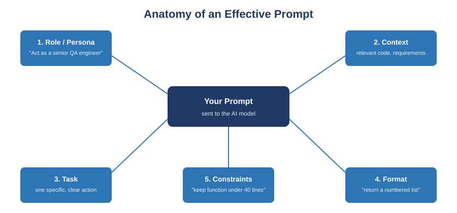

[← Back to course home](index.md)

# Guide 1: Prompt Engineering

**No background needed.** By the end of this page you'll know what a prompt is, why the same AI model can give a great answer or a useless one depending on how you ask, and how to write prompts you can reuse and improve like any other engineering artifact.

## 1. What is a prompt, really?

When you type into ChatGPT, Claude, or any AI assistant, that text is called a **prompt**. The AI model reads it and predicts the most likely helpful response, word by word. It has no memory of you, no assumptions about your project, and no ability to ask "wait, what do you mean?" unless you let it.

> **Analogy:** Think of the model as a brilliant new contractor who just walked onto your job site. They have excellent general skills, but zero knowledge of *your* house, *your* code, or *your* preferences until you tell them. A vague instruction ("fix the kitchen") gets a vague result. A specific one ("replace the cracked tile by the sink with a matching white 4x4 tile, grout to match the existing lines") gets exactly what you wanted.

**Prompt engineering** is the practice of designing that instruction — the wording, structure, and context — so the output reliably matches your intent, on the first try or after a small number of refinements.

### Why this is a real engineering skill, not just "typing well"

- It's **reproducible**: a good prompt template can be reused across many similar tasks (e.g., "review this function against our style guide") the same way a script or macro is reused.
- It's **testable**: you can compare two versions of a prompt against the same task and measure which one performs better.
- It's **documentable**: your prompts become part of your project's paper trail — useful for debugging AI-assisted work and required for this course's prompt logs.

## 2. The five components of a strong prompt

Most weak prompts are missing one or more of these five things. Use this as a checklist.

| Component | What it does | Example |
|---|---|---|
| **Role / Persona** | Frames the expertise and tone the model should adopt | "Act as a senior software architect reviewing a junior developer's design." |
| **Context** | Supplies facts the model cannot infer on its own | Paste the relevant user story, existing schema, or constraint. |
| **Task** | States one specific, singular action | "Identify missing edge cases in this function." |
| **Format** | Specifies the shape of the output | "Return a numbered list, one edge case per line, ≤20 words each." |
| **Constraints** | Bounds scope, style, or resources | "Do not modify the public API. Keep the function under 40 lines." |

**Try it mentally:** compare these two prompts for the same task.

- ❌ *Weak:* "Make this code better."
- ✅ *Strong:* "Act as a code reviewer focused on readability. Here is a Python function [paste code]. Identify up to 3 readability issues and suggest a fix for each. Return your answer as a markdown table with columns: Issue, Line, Suggested Fix. Do not change the function's behavior or public signature."

The second prompt tells the model *who* to be, *what* to look at, *what* to do, *how* to format the answer, and *what not* to touch. That's the difference between a usable answer and one you have to interrogate further.

## 3. Six principles that make prompts reliable

### 3.1 Be specific, not just detailed
Length isn't precision. A long prompt with a vague verb ("improve," "fix," "make better") still leaves the target undefined. Replace vague verbs with measurable ones: "reduce cyclomatic complexity below 10," "add input validation for null and empty-string cases," "convert to use async/await."

### 3.2 Give just enough context
Include what the model needs — relevant code, acceptance criteria, naming conventions — and nothing that distracts from the task. For a course SDLC artifact, this usually means pasting the relevant *section* of your Vision Document or SRS, not the entire document.

### 3.3 Specify the output format
Ask for exactly the shape you need: a table, a bulleted list, a JSON object matching a schema, a section written in your SRS template's voice. This turns AI output into something you can drop directly into your work instead of manually reformatting.

### 3.4 Use examples (few-shot prompting)
When a task has a "house style" — how your team writes acceptance criteria, or your docstring format — show 1–2 examples of *good* output before asking for a new one in the same style. This is called **few-shot prompting**. Asking with no examples at all is **zero-shot prompting**; it works for simple tasks but struggles with anything stylistically specific.

### 3.5 Decompose complex tasks
Asking a model to "build the whole feature" in one prompt produces shallow, hard-to-verify results. Break it into stages — design, then implementation, then tests, then docs — and review each stage before moving to the next, the same way you'd delegate work to a junior engineer.

### 3.6 Ask for reasoning on non-trivial tasks
For design decisions or debugging, ask the model to lay out its reasoning or trade-offs *before* giving a final answer. This surfaces assumptions you can check and often improves the final answer itself. This technique is sometimes called **chain-of-thought prompting**.

## 4. Prompt patterns for common SDLC tasks

| SDLC Activity | Pattern | What the prompt should include |
|---|---|---|
| Requirements / Vision Doc | Elicit-and-Structure | Raw stakeholder notes + target section headings + a request to flag ambiguities |
| SRS / SDS drafting | Template-Fill | Your document template's exact headings + relevant context, asking the model to fill it, not invent structure |
| Code generation | Spec-to-Code | Function signature, inputs/outputs, edge cases, and constraints (language, libraries, performance) |
| Code review | Critique-Against-Criteria | The code/diff + an explicit checklist (style guide, security, complexity) to review against |
| Test generation | Coverage-Target | The function/module + which behaviors or edge cases must be covered, and the test framework to use |
| Refactoring | Preserve-and-Improve | The code + what must stay identical (behavior, API) + what should improve (readability, complexity) |
| Debugging | Reproduce-and-Diagnose | The error/stack trace, minimal reproduction steps, and what you already ruled out |
| Documentation | Audience-Targeted | The artifact + intended reader (end user vs. maintainer) + required format |

## 5. Iterate — don't hand-patch

Treat your first prompt as a draft, not a final product. When the output is close but not right:

1. Identify **exactly** what's wrong or missing — be as specific with yourself as you were with the model.
2. Revise the **prompt** to close that gap (add a missing constraint, an example, or a clearer task statement).
3. Regenerate rather than manually patching the output by hand.

A well-refined prompt is reusable on the next similar task. A manually patched output is a one-off fix you'll have to redo next time.

## 6. Evaluate output like a code review

Before accepting AI output, check it against this rubric — the same way you'd review a teammate's pull request:

| Dimension | Ask yourself |
|---|---|
| **Correctness** | Does the output actually satisfy the requirement, not just look plausible? |
| **Completeness** | Are edge cases, error handling, and non-functional requirements addressed? |
| **Traceability** | Can you point to the requirement or design decision each part satisfies? |
| **Consistency** | Does it match existing naming, style, and architectural conventions? |
| **Risk** | Could this be subtly wrong in a way that's expensive to discover later (security, data loss, incorrect business logic)? |

## 7. Common pitfalls

- **Vague verbs** ("improve," "fix," "make better") without a measurable target.
- **Treating AI output as ground truth** instead of a draft that needs verification against tests, requirements, or a second source.
- **Omitting constraints**, then being surprised the model changed something that needed to stay fixed (an API, a schema, a public interface).
- **Pasting untrusted external content** (scraped web pages, third-party files) directly into an AI tool's context without treating it as untrusted input — this is how *prompt injection* attacks succeed, where hidden instructions in that content try to hijack the model's behavior.
- **Skipping iteration** — accepting a mediocre first response instead of refining the prompt once you know what's missing.
- **Not keeping a prompt log** for graded or shared work, which makes it hard to reproduce or defend your process.

## Try It Yourself

1. **Prompt Anatomy Deconstruction.** Take a vague prompt you've written before (or "write some tests for this"). Label which of the five components (Section 2) are missing, then rewrite it to include all five. Run both through an AI tool and compare the outputs.
2. **Zero-Shot vs. Few-Shot.** Pick a repetitive documentation task from your project. Write a zero-shot version (no examples) and a few-shot version (1–2 examples of your team's style) of the same request. Compare how much manual editing each output needs.
3. **SDLC Artifact Drafting With Iteration.** Draft one section of your Vision Document or SRS using the Template-Fill pattern. Review the first output against the Section 6 rubric, revise the *prompt* (not the output) to close at least two gaps, and regenerate. Keep all versions.
4. **Prompt Log.** Start your prompt log now: for every exercise, record the tool used, the prompt, a one-line summary of the output, and whether you accepted, revised, or rejected it. You'll extend this log throughout the course.

## Further Reading

- Anthropic — [Prompt engineering overview](https://docs.claude.com/en/docs/build-with-claude/prompt-engineering/overview) (official documentation)
- Anthropic — [Prompt engineering best practices](https://claude.com/blog/best-practices-for-prompt-engineering) (blog)
- Anthropic — [Interactive Prompt Engineering Tutorial](https://github.com/anthropics/prompt-eng-interactive-tutorial) (free, hands-on, GitHub)
- OpenAI — [Prompt engineering guide](https://platform.openai.com/docs/guides/prompt-engineering) (official documentation)

---
[← Back to course home](index.md) · [Next: AI Agents & Agentic Workflows →](02-ai-agents-agentic-workflows.md)
