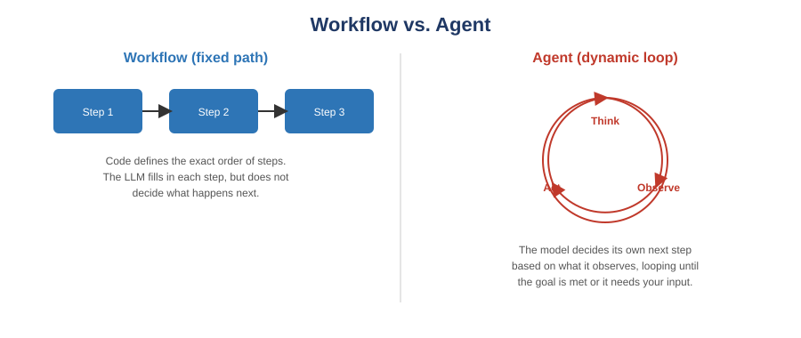

[← Back to course home](index.md)

# Guide 2: AI Agents & Agentic Workflows

**Prerequisite:** [Guide 1: Prompt Engineering](01-prompt-engineering.md). Everything below assumes you can already write a clear, well-structured prompt — agents are built out of prompts, just chained and automated.

## 1. From single answers to systems that act

Everything in Guide 1 covered a **single-turn interaction**: you send one prompt, the model sends back one response, done. Most real engineering tasks aren't single-turn — "add a feature and make sure the existing tests still pass" involves reading files, writing code, running a command, checking the result, and possibly trying again.

An **agentic system** is software where an AI model doesn't just answer once — it takes actions (like reading a file, running a command, or calling an API), observes the result, and decides what to do next, repeating until the goal is met.

## 2. Workflows vs. Agents — an important distinction

Anthropic's engineering team, whose framing has become the standard vocabulary in the field, draws a precise line between two things people often lump together as "agents":

- **Workflows** are systems where the LLM and tools are orchestrated through a **predefined code path**. The order of steps is fixed by you (or the software); the LLM fills in the content of each step but doesn't choose what happens next.
- **Agents** are systems where the LLM **dynamically directs its own process** — it decides what to do next based on what it observes, in a loop, until the task is done or it needs your input.

**Why the distinction matters practically:** workflows are more predictable, cheaper, and easier to test — use them when a task can be broken into clear, repeatable subtasks. Agents are more flexible and can handle open-ended or unpredictable tasks, but cost more (more model calls), are harder to fully test in advance, and need more guardrails. **Start with a workflow. Only reach for a full agent when the task genuinely can't be pinned down into fixed steps.**

## 3. The Think → Act → Observe loop

Inside an agent, each cycle typically looks like this:

1. **Think:** the model reasons about the current state and decides on the next action.
2. **Act:** it executes that action — e.g., reads a file, runs a test, calls an API.
3. **Observe:** it receives the result of that action (file contents, test output, an error message).

This repeats until the model decides the goal is met, it hits a limit you've set, or it needs to hand control back to you.

> **Analogy:** think of a new engineer debugging an unfamiliar codebase. They don't write the whole fix blind — they read a file (*act*), see what's there (*observe*), form a hypothesis (*think*), run the tests (*act*), see if they pass (*observe*), and repeat. An agent automates that same loop.

## 4. Why software engineering is a strong fit for agents

Code is one of the best domains for agentic systems because the results are **verifiable through automated means** — tests either pass or they don't, a linter either flags an issue or it doesn't, a build either succeeds or fails. That objective feedback lets an agent check its own work at each step, which is exactly what the Observe stage needs to be trustworthy.

## 5. Designing prompts for agents (beyond single-turn prompting)

Agentic tools need a few things a single-turn prompt doesn't:

### 5.1 State the goal, not just the first step
Agents plan ahead when given the end goal ("implement this feature and make the existing test suite pass") rather than only the first action ("open this file"). Give it enough of the goal that it can sequence its own steps.

### 5.2 Set explicit boundaries
Because agents can take actions with real effects, specify what's **out of scope**: files it shouldn't touch, commands it shouldn't run, and when it should stop and ask instead of proceeding.

### 5.3 Ask for a plan before execution
For any change with real consequences, ask the agent to propose a plan and wait for your confirmation before executing. This gives you a checkpoint to catch a misunderstood requirement before changes pile up.

### 5.4 Verify with ground truth, not self-report
The strongest agentic prompts pair the task with an objective way to check the result — an existing test suite, a linter, explicit acceptance criteria — rather than trusting the agent's own summary of what it did. Build checkpoints where the agent (or you) pauses for review before anything irreversible happens, like deleting data or approving a transaction.

## 6. Common agent workflow patterns

You'll see these patterns named across tools and documentation — recognizing them helps you reason about what a given tool is actually doing:

| Pattern | How it works | Good fit for |
|---|---|---|
| **Prompt chaining** | Output of one LLM call becomes the input to the next, in a fixed sequence | Multi-stage tasks with a clear order (draft → critique → revise) |
| **Routing** | An initial classification step sends the task to a specialized prompt/tool | Tasks that fall into a few known categories (bug report vs. feature request) |
| **Evaluator–optimizer** | One call generates a response; another evaluates it and feeds back for revision | Tasks with a clear quality bar and value in iterative refinement |
| **Orchestrator–worker** | A central LLM breaks a task into subtasks and delegates them | Complex tasks whose subtasks can't be predicted in advance |
| **Autonomous agent** | The model plans, acts, and observes in a loop with minimal fixed structure | Open-ended tasks where the path can't be predefined at all |

## 7. Risks and guardrails specific to agents

- **Compounding errors:** because each step builds on the last, an early mistake can snowball. Frequent verification (tests, review checkpoints) catches this early.
- **Scope creep:** an under-constrained agent may "helpfully" touch files or systems outside the task. Explicit boundaries (Section 5.2) are your main defense.
- **Cost and latency:** every Think/Act/Observe cycle is a model call. Agentic systems trade speed and cost for flexibility — that trade-off should be a deliberate choice, not a default.
- **Irreversible actions:** anything that deletes data, sends external communications, or spends money should have a human-approval checkpoint before execution, not after.

## Try It Yourself

1. **Classify three real tasks.** Take three tasks from your capstone backlog. For each, decide: is this better suited to a fixed workflow or an open-ended agent? Justify your answer using Section 2.
2. **Trace a Think-Act-Observe loop.** Pick one small, bounded task (e.g., "find and fix a failing test"). Manually write out what a Think, Act, and Observe step would look like at each stage, before using any tool to do it for you.
3. **Agentic Task Decomposition.** Choose a small, self-contained feature or fix from your project. Write an agent-style prompt (Section 5) that states the end goal, explicit boundaries, and a verification method. Ask the agent to propose a plan first; review it before allowing execution. Verify the result using your stated method — not the agent's own summary. Log this in your prompt log.

## Further Reading

- Anthropic — [Building Effective Agents](https://www.anthropic.com/engineering/building-effective-agents) (the original essay this guide's vocabulary is drawn from)
- Anthropic — [Agent patterns reference implementations](https://github.com/anthropics/claude-cookbooks/tree/main/patterns/agents) (runnable code examples for each pattern in Section 6)

---
[← Previous: Prompt Engineering](01-prompt-engineering.md) · [Back to course home](index.md) · [Next: Custom GPTs & AI Assistants →](03-custom-gpts-ai-assistants.md)
