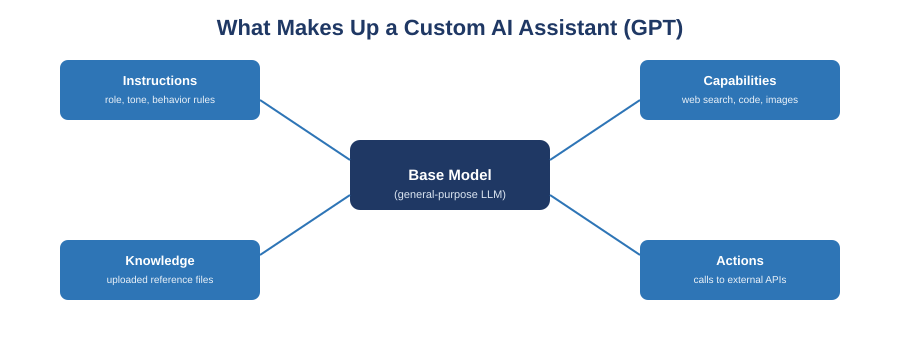

[← Back to course home](index.md)

# Guide 3: Custom GPTs & AI Assistants

**Prerequisite:** [Guide 1: Prompt Engineering](01-prompt-engineering.md). A custom GPT is, under the hood, a saved and reusable prompt configuration — everything you learned about writing clear instructions applies directly here.

## 1. The problem custom GPTs solve

Imagine you've written a great prompt for reviewing pull requests against your team's style guide. Without a custom GPT, every teammate who wants to use it has to copy your exact wording into a fresh chat, every single time, and re-paste the style guide as context. That's fragile and doesn't scale.

A **custom GPT** (OpenAI's term) or **custom AI assistant** (the general term — Anthropic's equivalent concept is a *Project* with custom instructions, or a Claude *skill*) packages a prompt configuration into something reusable: a saved assistant with a fixed personality, fixed reference material, and a fixed set of capabilities, ready to use with no re-explaining.

> **Analogy:** a plain chat is like calling a general contractor from scratch every time. A custom GPT is like having a specific subcontractor on retainer who already knows your house, your preferences, and exactly which tools they're allowed to use.

## 2. What a custom GPT is made of

| Piece | What it is | Example |
|---|---|---|
| **Instructions** | The system-level prompt defining role, tone, and behavior rules — this is Guide 1's five components, written once and reused | "You are a code reviewer for our Python style guide. Always cite the specific rule violated. Never rewrite more than the flagged lines." |
| **Knowledge** | Files you upload that the assistant can reference | Your team's style guide PDF, a glossary, past examples of "good" output |
| **Capabilities** | Built-in tools you turn on or off | Web search, code execution, image generation, data analysis |
| **Actions** | Connections to external APIs so the assistant can retrieve or modify real data outside the chat | Look up a ticket status in Jira, create a calendar event |

A custom GPT is still just a base language model underneath — nothing about its underlying "intelligence" changes. What changes is that instructions, reference material, and allowed tools are pre-loaded so you don't have to re-supply them every time.

## 3. When a custom GPT is worth building

Not every task needs one. Use the test below.

| Situation | Better fit |
|---|---|
| One-off question, quick rewrite, brainstorming | Plain chat |
| You keep reusing the same prompt or re-uploading the same reference file | Custom GPT |
| A task needs to be consistent across a team | Custom GPT |
| The task needs a fixed "house style" every time | Custom GPT |
| You need it to browse the web, run code, or generate images automatically without asking each time | Custom GPT with capabilities enabled |
| It needs to fetch or update live data in another system | Custom GPT with an action configured |

## 4. Writing good instructions (the most important part)

Instructions are just a prompt — apply everything from Guide 1:

- **Role:** who is this assistant, and for whom?
- **Task boundaries:** what should it always do, and what should it explicitly avoid doing?
- **Format:** what should its typical response look like?
- **Constraints:** tone, length limits, what NOT to change or invent.

A common mistake is writing instructions as a vague vibe ("be helpful and friendly") instead of specific, testable behavior rules ("if the user's request is ambiguous, ask one clarifying question before answering; never fabricate a citation").

## 5. A worked example: building a "Vision Document Reviewer" assistant

1. **Define the role:** "You are a reviewer for Vision Documents in a capstone software engineering course, checking them against ABET-aligned course learning objectives."
2. **Upload knowledge:** the course's Vision Document template and a rubric.
3. **Write instructions:** "For each section a student submits, check it against the uploaded rubric. Cite the exact rubric line for every issue you flag. If a section is missing, say so explicitly rather than inventing content for it."
4. **Decide on capabilities:** no web search or code execution needed here — turn them off to keep behavior predictable.
5. **Test it** with a real (deliberately imperfect) student submission before trusting it, the same way you'd test any tool before relying on it.

## 6. Guardrails specific to custom assistants

- **Knowledge files are not private by default** in every sharing configuration — never upload sensitive data (student records, credentials, unpublished research data) unless you've confirmed the sharing and data-use settings.
- **Actions call real external systems.** Test any action against a sandbox or non-production account before connecting it to anything that can modify real data.
- **Instructions can be inspected or extracted** by users interacting with a shared assistant — don't rely on hidden instructions as a security boundary.
- **Iterate the same way you iterate a prompt:** if the assistant misbehaves, fix the instructions, don't just work around the bad output each time.

## Try It Yourself

1. **Fit test.** Take three recurring tasks from your own workflow (course-related or otherwise). Using the table in Section 3, decide which ones justify a custom GPT and which don't. Justify each answer in one sentence.
2. **Draft instructions.** Using Section 4's checklist, draft the full instruction text for one assistant you identified in Exercise 1 — even if you don't build it yet. Include role, task boundaries, format, and constraints.
3. **Build and stress-test one.** If you have access to a GPT builder or equivalent, build the assistant from Exercise 2. Test it with at least one input designed to break it (missing information, an edge case, an ambiguous request) and note how it handled it.

## Further Reading

- OpenAI — [Using custom GPTs](https://openai.com/academy/custom-gpts/) (official overview and use cases)
- OpenAI — [Creating and editing GPTs](https://help.openai.com/en/articles/8554397-creating-and-editing-gpts) (official help center, current plan/feature availability)
- OpenAI — [Introducing GPTs](https://openai.com/index/introducing-gpts/) (original announcement, explains the underlying concept)

---
[← Previous: AI Agents & Agentic Workflows](02-ai-agents-agentic-workflows.md) · [Back to course home](index.md) · [Next: Claude Code Basics →](04-claude-code-basics.md)
