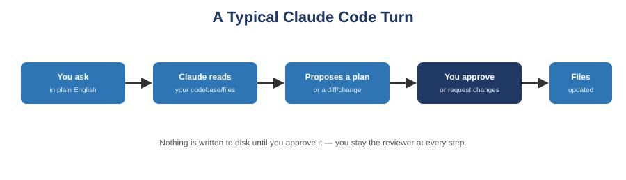

[← Back to course home](index.md)

# Guide 4: Claude Code Basics

**Prerequisites:** [Guide 1: Prompt Engineering](01-prompt-engineering.md) and [Guide 2: AI Agents & Agentic Workflows](02-ai-agents-agentic-workflows.md). Claude Code is a real-world example of the agent concepts from Guide 2, applied specifically to software engineering.

## 1. What Claude Code is

Claude Code is an **agentic coding tool**: you give it a task in plain English, and it reads your codebase, plans an approach, edits files, and runs commands to accomplish it — following the Think → Act → Observe loop from Guide 2. It's available in the terminal, as an IDE extension (VS Code, JetBrains), in a desktop app, and in the browser.

The key difference from a plain chat assistant: Claude Code doesn't just describe what code to write — it can directly read your project's files, make the edits, and run your tests, all within guardrails you control.



## 2. Installing it

You'll need a terminal and a project folder to work in. Two install options (choose one):

**Option A — npm (if you already have Node.js 18+):**
```
npm install -g @anthropic-ai/claude-code
```

**Option B — native installer (macOS/Linux/WSL):**
```
curl -fsSL claude.ai/install.sh | bash
```
*(Windows PowerShell equivalent: `irm https://claude.ai/install.ps1 | iex`)*

Then start it inside any project directory:
```
cd /path/to/your/project
claude
```
You'll be prompted to log in the first time. After that, your credentials are stored securely on your machine.

## 3. Your first session

Once you see the Claude Code prompt, start small. Two categories of first questions:

**Understanding the codebase (read-only, safe to try immediately):**
```
> what does this project do?
> what technologies does this project use?
> where is the main entry point?
> explain the folder structure
```
Claude Code reads your files as needed to answer — you don't have to manually paste code as context, unlike a plain chat interface.

**Making a change (Claude Code will always show you the change before touching disk):**
```
> add a hello world function to the main file
```
For any edit, Claude Code will: (1) find the appropriate file, (2) show you the proposed change as a diff, (3) ask for your approval, (4) only then make the edit. **Nothing is written to disk until you approve it** — you remain the reviewer at every step, which is exactly the "checkpoint before execution" guardrail from Guide 2, Section 5.3.

## 4. Applying prompt engineering to an agentic coding tool

Everything from Guide 1 still applies, with an agent-specific twist from Guide 2:

- **State the goal, not just the first step:** "Implement input validation for the signup form and make sure the existing test suite still passes" gives Claude Code enough to plan multiple steps, rather than "open signup.py."
- **Set boundaries explicitly:** "Don't modify anything under `/migrations`" or "only touch files in `src/api/`" keeps the agent's scope contained.
- **Ask for a plan on anything nontrivial:** for larger changes, ask it to outline its approach first, and review that plan before saying "go ahead."
- **Verify with ground truth:** after a change, run your actual test suite yourself rather than trusting a summary — "the tests pass" is a claim you should confirm, the same way you'd confirm a teammate's claim in a pull request.

## 5. A realistic first workflow

1. `cd` into your project and run `claude`.
2. Ask an understanding question first: `what does this module do and where are its tests?`
3. State a bounded task with a verification method: `add a function that validates email format in utils/validation.py, and add unit tests for it in the existing test file. Run the tests after and report the result.`
4. Review the proposed diff carefully — read it the way you'd review a pull request, not the way you'd skim a summary.
5. Approve, or give specific feedback ("keep the function name consistent with the other validators in this file") and let it revise.
6. After it reports success, **run the test suite yourself** to confirm independently.
7. Log the task, the prompt you used, and the outcome in your prompt log.

## 6. What Claude Code is not good for (yet)

- It is not a substitute for understanding the code it writes — you are accountable for what gets committed, and you should be able to explain any line of it.
- It should not be pointed at tasks with real-world irreversible consequences (deleting production data, pushing directly to a protected branch) without a human checkpoint, per Guide 2's guardrails.
- It works best on well-scoped tasks. Extremely vague requests ("make the whole app better") will produce the same shallow results a vague prompt produces anywhere else — Guide 1's principles about specificity still govern the outcome.

## Try It Yourself

1. **Read-only exploration.** In a project you already have locally (or a small public repo you clone for practice), run three understanding questions from Section 3. Note what Claude Code got right and anything it got wrong or had to guess at.
2. **Bounded task with verification.** Pick one small, well-scoped task (a single function, a single bug fix). Write your task prompt using Section 4's guidance (goal, boundaries, verification method). Review the proposed diff before approving. Independently run your test suite afterward rather than trusting the summary.
3. **Prompt log entry.** Add this session to your prompt log: the task prompt, whether you approved the first proposal or asked for a revision, and the independent verification result.

## Further Reading

- Anthropic — [Claude Code overview](https://code.claude.com/docs/en/overview) (official documentation)
- Anthropic — [Claude Code quickstart](https://code.claude.com/docs/en/quickstart) (step-by-step official install and first-session guide)

---
[← Previous: Custom GPTs & AI Assistants](03-custom-gpts-ai-assistants.md) · [Back to course home](index.md) · [Next: Choosing the Right AI Tool →](05-choosing-the-right-tool.md)
